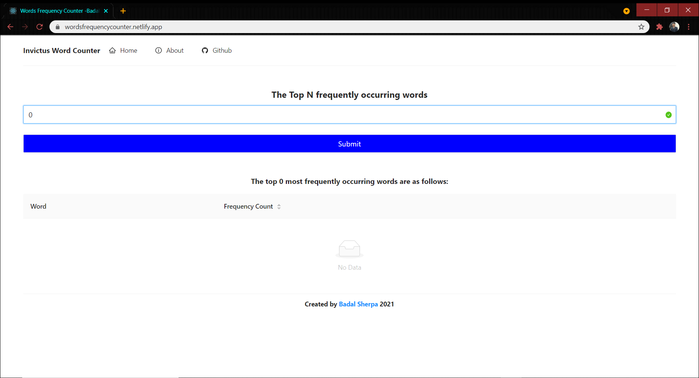
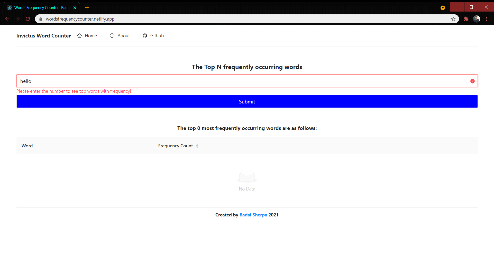
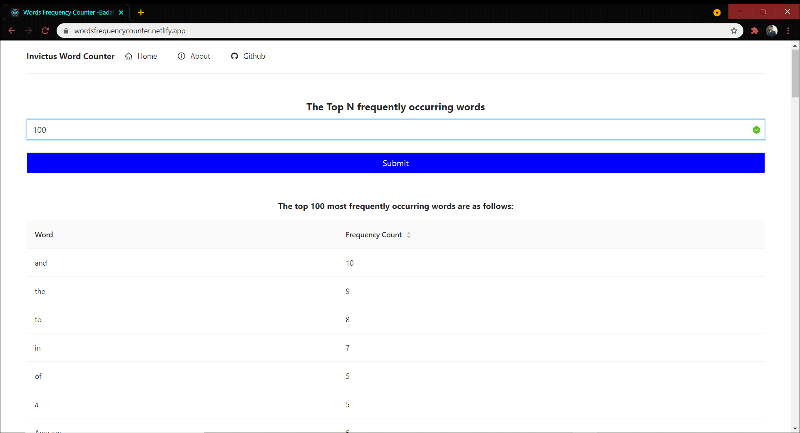
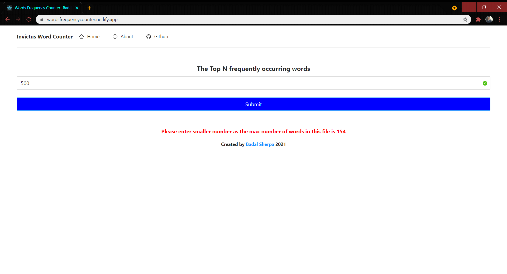
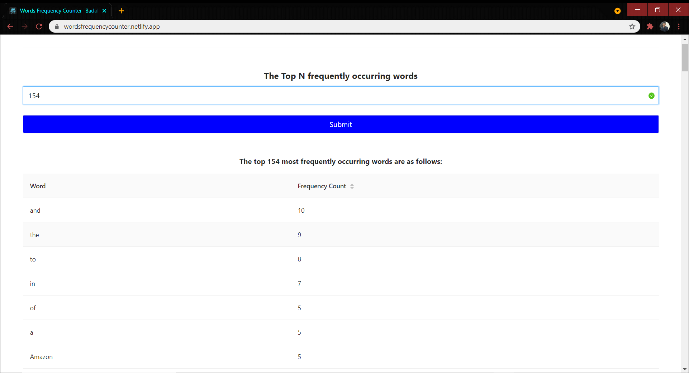

# Getting Started with this words counter web application

This online web application is build using React js and [Ant Design](https://ant.design/) as the UI framework.
This application fetches the string data from this [path](https://raw.githubusercontent.com/invictustech/test/main/README.md) and checks the top N frequelty occuring words in this file.

The web application is hosted live using netlify:

[Website Link](https://wordsfrequencycounter.netlify.app/)

### Libraries / Packages used

1. [Ant Design](https://ant.design/)
2. [Axios](https://www.npmjs.com/package/axios)
3. [React-Router-Dom](https://www.npmjs.com/package/react-router-dom)

### Components

All of my components are inside src folder.

Inside src folder there is the components folder and inside the component folder there is the layout folder where I have created the layout of the web application. I have created the Header, Body, Footer and the MainLayout js files here.

Inside the Body I have created the form component where I will take the user input which will be a number. I have used the andt design form and validated the input to accept only numbers. If its string or other datatype it will throw an error.

After fetching the number input from the user I am fetching the file data using axios and storing the string data inside a usestate variable.
I am sending the number and the string data to the TableComponent as a props inside the Body component and in the TableComponent which is inside the commom folder I am accessing the number and the string data.

Inside this TableComponent I have created a function named wordFreq where I am counting the frequency of the unique words present in the data and storing the frequency inside the freqMap as objects. After storing the frequency of every elements I have created the function name sortObject where I am sorting the frequency of words in descending order and storing the sorted object inside usestate array arr1.

Now to display the top N frequently occuring words. I have created an empty array a[] and using for loop i am pushing only the N key value pair inside the empty array a[] and using ant design Table I am displaying the words and frequency of the words in descending order.

I have also create about page and linked it using react-router-dom that can be viewed in the live web application.

# Test Cases

### when the input is 0.

when the input is 0 no words will be pushed into empty array a[] and no data will be shown.

### when the input is string.

when the input is a string the form will throw an error as validation regex pattern is made to allow only integers.

## when the input is number is between 1 to the total words present in the file.

when the input is the number between 1 to the total words present it will display the occurance of words in descending order inside a table which can also be viewed in ascending order by clicking at the Frequency Count column title.

## when the input number is larger than the total number of words.

when the input number is larger than the total number I have created a condition to show worning instead of the table.

## when the input is number last word count or the total words count.

when the input number is the total words or the maximum words present in the sentence or file then it will display all the words in descending order.

# Getting Started with Create React App

This project was bootstrapped with [Create React App](https://github.com/facebook/create-react-app).

## Available Scripts

In the project directory, you can run:

### `yarn start`

Runs the app in the development mode.\
Open [http://localhost:3000](http://localhost:3000) to view it in the browser.

The page will reload if you make edits.\
You will also see any lint errors in the console.

### `yarn build`

Builds the app for production to the `build` folder.\
It correctly bundles React in production mode and optimizes the build for the best performance.

The build is minified and the filenames include the hashes.\
Your app is ready to be deployed!

See the section about [deployment](https://facebook.github.io/create-react-app/docs/deployment) for more information.
